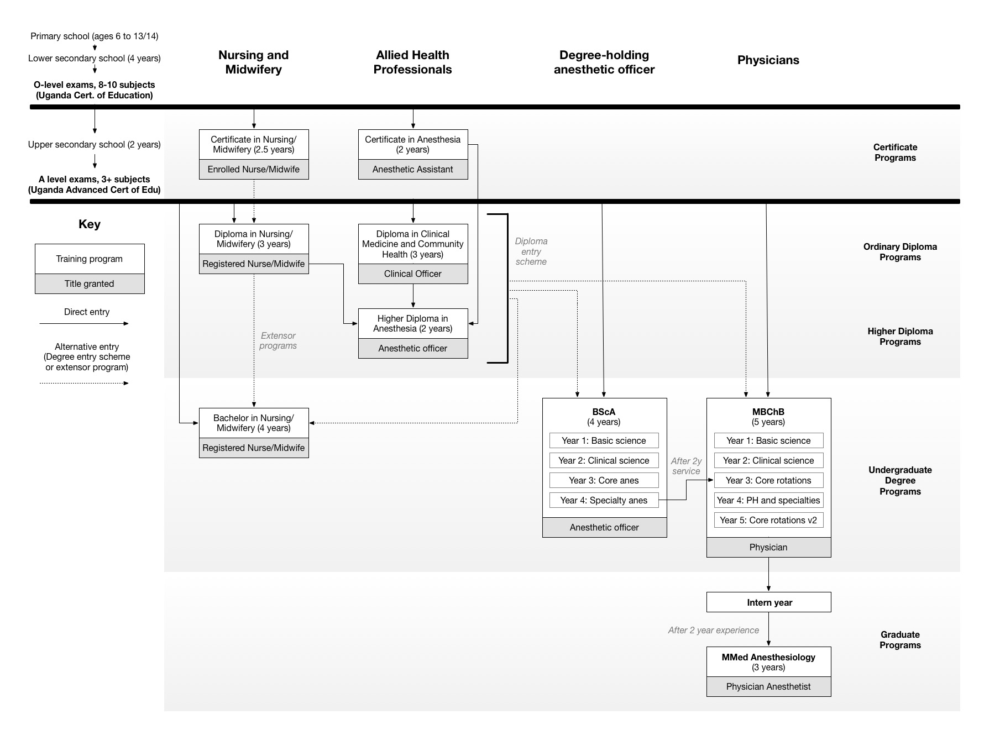

# Data Requirements for Uganda Anesthesia Provider Model

Overall, this model aims to chart the path of training and employement of physician and non-physician anesthetists in Uganda from ~1990 to 2045. In additon, we would like to estimate the costs and effects of various interventions aimed at increasing the number of practicing anesthetists.  In order to do so, we need various pieces of data to inform the model. These can be broadly divided into: 
- training
- distribution
- intervention-specific

Here I have included a description of best-available data. Key unknown parameters are shown with a "?".

## Training

### Training structure

Here, I've included a schematic that characterizes my current understanding of the training process for various anesthesia providers. Click to see a full view. 

### History of training

According to Bulamba et al <cite data-cite="bulamba2018"><a href="https://github.com/alexgoodell/uganda-model/blob/master/refs/cite-md/bulamba2018.md">(bulamba2018)</a></cite> notes the following significant events in the development of anesthesia in Uganda (other events added as data permit).

| Time period |                                                Event                                                |     Source    |
|-------------|-----------------------------------------------------------------------------------------------------|---------------|
| Before 1890 | All anesthesia traditional medicine                                                                 | bulamba2018   |
| 1890        | First documented anesthetic delivered                                                               | bulamba2018   |
| 1924        | Makarere Medical School founded                                                                     | bulamba2018   |
| 1960's      | Mulago Paramedical School founded, training medical assistants                                      | bulamba2018   |
| 1962        | Mulago Hospital founded                                                                             | bulamba2018   |
| 1970        | MakCHS Department of Anaesthesia founded                                                            | bulamba2018   |
| 1971        | Anes. assistant program begins (post O-lvl, 3y training, 8 students per year)                       | bulamba2018   |
| 1970's      | Mulago Dept Anes formed by Dr. Kityo, no training                                                   | bulamba2018   |
| 1980        | J. Wilson Carswell writes that there are no practing physician anesthetists                         | carswell1980  |
| 1983        | One-year post-MBChB Diploma in Anes (not MMed) started at Mulago, 2 annually                        | bulamba2018   |
| 1985        | Commonwealth: AO req previous RN/CO. AO training reduced to 18 months with six months of internship | bulamba2018   |
| 1985        | MMed anesthesia founded at MakCHS (req diploma and MBChB, 2/y)                                      | bulamba2018   |
| 1987        | Entry requirement for Mmed changed to just intern, not diploma year                                 | bulamba2018   |
| 1988        | Graduation of the first Ugandan trained physician anaesthetists                                     | bulamba2018   |
| 1990's      | Lacor, Gulu AO programs founded "within last 30 years"                                              | bulamba2018   |
| 1995        | Mbarara Regional referral hospital opens                                                            | bulamba2018   |
| 2000        | MMed program at MUST began, enrolling 2-3 student per year (avg 2.66 per year)                      | bulamba2018   |
| 2001        | 188 students trained as Anesthesia Assistants (1y for CO/RN), unable to practice w/o Higher Dipl    | bulamba2018   |
| 2003        | New Vision article claims 12 practicing (5 expat) MDs, 144 AA's trained, 21 MDs trained, 144 AA's   | newvision2003 |
| 2006        | Uganda Anesthesia Fellowship program founded with support from AAGBI + GPAS                         | bulamba2018   |
| 2016        | Kabale and Mbale AO training programs were started                                                  | bulamba2018   |
| 2017        | Bachelor of Science in Anaesthesia (BScA) has been started at Busitema                              | bulamba2018   |

Sources: <cite data-cite="bulamba2018"><a href="https://github.com/alexgoodell/uganda-model/blob/master/refs/cite-md/bulamba2018.md">(bulamba2018)</a></cite>, <cite data-cite="newvision2003"><a href="https://github.com/alexgoodell/uganda-model/blob/master/refs/cite-md/newvision2003.md">(newvision2003)</a></cite>, <cite data-cite="carswell1980"><a href="https://github.com/alexgoodell/uganda-model/blob/master/refs/cite-md/carswell1980.md">(carswell1980)</a></cite>

### AO historical training estimates

|     Year    | AOs graduated (annually, nationwide) |     Source    |
|-------------|--------------------------------------|---------------|
| Before 2000 | ?                                    |               |
| 2000        | 16                                   | ahwo2009      |
| 2001        | 11                                   | ahwo2009      |
| 2002        | 13                                   | ahwo2009      |
| 2003        | 20                                   | ahwo2009      |
| 2004        | ?                                    |               |
| 2005        | ?                                    |               |
| 2006        | ?                                    |               |
| 2007        | ?                                    |               |
| 2008        | ?                                    |               |
| 2009        | ?                                    |               |
| 2010        | 33                                   | hrhaudit2015b |
| 2011        | 23                                   | hrhaudit2015b |
| 2012        | 18                                   | hrhaudit2015b |
| 2013        | 26                                   | hrhaudit2015b |
| 2014        | 15                                   | hrhaudit2015b |
| 2015        | 26                                   | hrhaudit2015b |
| 2016        | ?                                    |               |
| 2017        | ?                                    |               |
| 2018        | ?                                    |               |

Sources: <cite data-cite="ahwo2009"><a href="https://github.com/alexgoodell/uganda-model/blob/master/refs/cite-md/ahwo2009.md">(ahwo2009)</a></cite>, <cite data-cite="hrhaudit2015b"><a href="https://github.com/alexgoodell/uganda-model/blob/master/refs/cite-md/hrhaudit2015b.md">(hrhaudit2015b)</a></cite>

### AO current training estimates

List of programs source: <cite data-cite="mohscholar2017"><a href="https://github.com/alexgoodell/uganda-model/blob/master/refs/cite-md/mohscholar2017.md">(mohscholar2017)</a></cite>

|                        Program                        | Expected Output |     Source    |
|-------------------------------------------------------|-----------------|---------------|
| UAHIMS-Mulago                                         | ?               |               |
| Mbale School of Clinical Officers                     | ?               |               |
| Fort Portal School of Clinical Officers               | ?               |               |
| Lacor School of Anesthesia                            | 25              | lacoranes2018 |
| Gulu School of Clinical Officers                      | ?               |               |
| Ishaka Adventists Anaesthetic Officer Training School | ?               |               |
| Kitovu Catholic Anaesthetic Officer Training School   | ?               |               |
| __Total__                                             | ?               |               |

Sources: <cite data-cite="lacoranes2018"><a href="https://github.com/alexgoodell/uganda-model/blob/master/refs/cite-md/lacoranes2018.md">(lacoranes2018)</a></cite>, <cite data-cite="bulamba2018"><a href="https://github.com/alexgoodell/uganda-model/blob/master/refs/cite-md/bulamba2018.md">(bulamba2018)</a></cite>

### Physician anethetists historical training estimates

| Year | Physician anesthetists graduated (annually, nationwide) |           Source/Comments            |
|------|---------------------------------------------------------|--------------------------------------|
| 1988 | 2                                                       | bulamba2018                          |
| 1989 | ?                                                       |                                      |
| 1990 | ?                                                       |                                      |
| 1991 | ?                                                       |                                      |
| 1992 | ?                                                       |                                      |
| 1993 | ?                                                       |                                      |
| 1994 | ?                                                       |                                      |
| 1995 | ?                                                       |                                      |
| 1996 | ?                                                       |                                      |
| 1997 | ?                                                       |                                      |
| 1998 | ?                                                       |                                      |
| 1999 | ?                                                       |                                      |
| 2000 | ?                                                       | MMed program at MUST began           |
| 2001 | ?                                                       |                                      |
| 2002 | ?                                                       |                                      |
| 2003 | ?                                                       |                                      |
| 2004 | ?                                                       |                                      |
| 2005 | ?                                                       |                                      |
| 2006 | ?                                                       | 2 in training total, hewittsmith2018 |
| 2007 | ?                                                       |                                      |
| 2008 | ?                                                       |                                      |
| 2009 | ?                                                       |                                      |
| 2010 | ?                                                       |                                      |
| 2011 | ?                                                       |                                      |
| 2012 | ?                                                       |                                      |
| 2013 | ?                                                       |                                      |
| 2014 | 3                                                       |                                      |
| 2015 | 3                                                       | hewittsmith2018                      |
| 2016 | 3                                                       | hewittsmith2018                      |
| 2017 | 13                                                      | hewittsmith2018                      |

Sources: <cite data-cite="hewittsmith2018"><a href="https://github.com/alexgoodell/uganda-model/blob/master/refs/cite-md/hewittsmith2018.md">(hewittsmith2018)</a></cite>

### Physician anesthetists current training estimates

List of programs source: <cite data-cite="mohscholar2017"><a href="https://github.com/alexgoodell/uganda-model/blob/master/refs/cite-md/mohscholar2017.md">(mohscholar2017)</a></cite>

|                        Program                        | Expected Output |     Source    |
|-------------------------------------------------------|-----------------|---------------|
| UAHIMS-Mulago                                         | ?               |               |
| Mbale School of Clinical Officers                     | ?               |               |
| Fort Portal School of Clinical Officers               | ?               |               |
| Lacor School of Anesthesia                            | 25              | lacoranes2018 |
| Gulu School of Clinical Officers                      | ?               |               |
| Ishaka Adventists Anaesthetic Officer Training School | ?               |               |
| Kitovu Catholic Anaesthetic Officer Training School   | ?               |               |
| __Total__                                             | ?               |               |

### Miscellaneous training data needed 

- Graduation rates for physician and non-physician anesthetists programs
- Percent of graduating anethetists (physician and non-physician) that enter non-clinical careers or non-anesthesia specialties after graduation from anesthetia training

## Distribution

### Major distribution questions

The distribution of physician and non-physician anesthetists is poorly understood and requires synthesis of exsisting data sources. Please review the [data sources](/docs/data-sources.md) document, which discusses current available data regarding distribution. The primary questions of import are:
- How many physician and non-physician anesthetists are practicing in Uganda?
- Are there inequities in __geographic distribution__ of either physician or non-physician anesthetists?
	- Are they clustered in areas not designated as "hard to reach, hard to keep" by the government of Uganda?
	- Are they clustered near major urban areas?
- What are the inequities in the types of facilities that employ providers? Ie, private vs public, health center IV vs regional referral hospital.
- What is the sub-specialty make-up (cardiac, ICU, etc) of providers?

### Miscellaneous distribution questions

- Rate of migration of physician and non-physician anesthetist from underserved areas to well-served areas
- Rate of emmigration of physician and non-physician anesthetists out of Uganda to other nations

## Intervention-specific

In order to understand the costs and effects of specific policy-oriented interventions to improve access to safe anesthetia in Uganda, various intervention-specific data points are needed.

